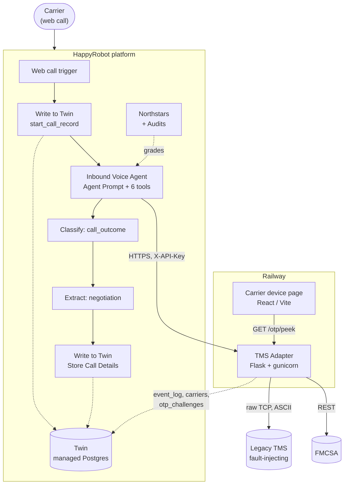

# Inbound Carrier Sales — Build Document

**Status:** draft · Version 2 of the workflow is built and audited, not yet published
**Repo:** this one (TMS adapter + carrier device page) · **Platform:** HappyRobot workspace `fdeshreyaskn`, workflow `test`

An inbound voice agent that answers carrier calls, verifies who is calling, finds
them a load, negotiates the rate inside a ceiling they never see, and hands a
closed deal to a rep — with every call recorded and every behaviour graded.

---

## 1. For the business

### The problem

Carrier reps spend their day on the phone answering the same call: *"what have you
got out of Ohio?"* Every one of those calls is a margin decision made live, by a
person, under time pressure, and none of it is written down. Three things leak:

- **Missed calls.** A rep on another line is a load that does not move.
- **Inconsistent margin.** What a carrier pays depends on which rep picked up and
  how much of a hurry they were in.
- **No audit trail.** When a rate looks wrong a week later, there is nothing to
  look at but a memory.

### What the agent does

A carrier calls and, without a rep:

1. **Gives their MC number.** The agent reads it back digit by digit and waits for
   confirmation before using it.
2. **Gets checked for authority** against FMCSA. No authority, no load.
3. **Proves they are who they say.** A six-digit code goes to the number on file;
   they read it back. This is the step that stops someone who has simply read an
   MC number off the side of a truck.
4. **Gets matched.** Equipment, where they are, where they want to go — one
   question at a time — then one load pitched with no price attached.
5. **Negotiates.** The agent opens, concedes on a fixed schedule, and stops. It
   cannot pay more than the load's ceiling because it is never told what the
   ceiling is.
6. **Closes.** Agreement is read back and confirmed out loud, then handed to a
   senior rep to finalise.

If any of that fails — no authority, no match, no deal — the agent says so plainly
and ends the call. Walking away is a result, not an error.

### What you get out of it

Every call writes a structured record: who called, whether they verified, what
lane they wanted, what was offered each round, what closed, and what the margin
was against the ceiling. That is the audit trail the manual process never had, and
it is what the KPIs are computed from:

| Metric | Reads |
|---|---|
| Booking conversion | share of verified calls that end `booked` |
| Average margin vs ceiling | how much of the allowed spend we kept |
| Verification pass rate | share of callers who clear the identity gate |
| Calls handled with no rep | the headline automation number |
| Average handle time | how long a carrier is on the phone |
| Negotiation rounds | how hard the ladder is being pushed |

### What it is not, yet

Stated plainly, because these matter more than the feature list:

- **The booking is recorded, not committed.** Our TMS access is read-only for this
  exercise, so the final write to the load board is present in code and commented
  out. Everything else about the deal is captured.
- **The identity code arrives on a web page, not by SMS.** No phone number or SMS
  channel was provisioned for the workspace, so the code appears on a "carrier
  device" page that stands in for a handset. The security properties — single use,
  expiry, attempt limit — are real; only the delivery channel is a stand-in.
- **The hand-off to a rep is mocked.** The agent says a rep will take it from here;
  no live transfer is wired.

---

## 2. For IT

### Architecture



Everything inside the platform box is native HappyRobot. Two things sit outside,
both because native could not do them:

| External service | Why it has to exist |
|---|---|
| **TMS adapter** | The agent calls HTTP tools. The TMS speaks raw TCP with fixed-width ASCII frames and injects faults. Something has to translate, and it also has to be the place the price ceiling lives. |
| **Carrier device page** | SMS and email delivery were unavailable for the org and no phone number is provisioned. The page is the reproducible stand-in for a code arriving on a handset. |

Everything else — the call itself, the data store, the evals, the transcripts — is
platform-native. That is deliberate: the brief grades simplicity, and the platform
already ships the pieces.

### The adapter

Flask + gunicorn, Dockerised, deployed on Railway. Every `/tools/*` endpoint is
behind `X-API-Key`.

| Endpoint | Purpose |
|---|---|
| `POST /tools/verify_carrier` | FMCSA authority check. **Mints the OTP** the moment authority clears. |
| `POST /tools/search_loads` | Board search. Refuses a query with no origin. |
| `POST /tools/get_load` | Full load record, ceiling stripped. |
| `POST /tools/evaluate_offer` | The negotiation decision. Returns the next number to say. |
| `POST /tools/book_load` | Records the closed deal server-side. |
| `POST /tools/send_otp` | Re-send path only. |
| `POST /tools/verify_otp` | The identity gate. |
| `GET /otp/peek` | **Public, no auth** — the device page reads its own code, like a handset. |
| `GET /health` | Liveness. |
| `GET /debug/*` | Dev-only, API-key-gated, unreachable from the workflow. |

Full request/response shapes: [`docs/api-reference.md`](api-reference.md).
Wire protocol: [`docs/tms-protocol.md`](tms-protocol.md).

### The three things the agent must never see

The security model is not "the prompt says don't" — it is that the values are not
in the agent's context to leak.

1. **`MAX_BUY`**, the per-load ceiling. Fetched by the adapter, kept server-side,
   stripped from every agent-facing response.
2. **The posted loadboard `RATE`**, stripped for the same reason — the agent opens
   below it, and a visible posted rate invites the agent to anchor on it.
3. **The OTP code.** `send_otp` returns delivery metadata only. The agent never
   holds a value it could be talked into reading out.

`margin_vs_ceiling` is written to Twin server-side rather than passed through the
agent, because `agreed_rate + margin_vs_ceiling = MAX_BUY` — returning it would
leak the ceiling by arithmetic.

### Negotiation

`evaluate_offer(load_id, round, carrier_offer)` returns `accept` / `counter` /
`reject` / `clarify`. The ladder is a fraction of that load's own `MAX_BUY`:

```
round 0  →  85%     opening offer, made unprompted
round 1  →  91%
round 2  →  94.75%
round 3  →  97%     final rung
round 4  →  the ONE round that stretches: accepts anything at or below MAX_BUY
beyond   →  holds at the 97% rung; takes at-or-below, refuses above
```

Two things are load-bearing here:

- **It anchors on `MAX_BUY`, not the posted rate.** In the real data the ceiling
  sits roughly 10% *below* the posted rate, so anchoring on the posted number
  would systematically overpay.
- **The stretch happens once.** An earlier version accepted anything under the
  ceiling from round 4 onward. Because each call is stateless, a carrier who
  simply kept raising was accepted at every step — a live call climbed
  $790 → $820 → $860 → $900 against a $901 ceiling, six accepts in a row, every
  one of them a number the caller had just invented.

`clarify` handles mis-heard numbers: a caller saying "nine hundred" that arrives as
`90` gets read back for confirmation rather than booked.

### Data

Twin, HappyRobot's managed Postgres. Four tables keyed on the workflow's `run_id`:

| Table | Writer | Contents |
|---|---|---|
| `call_records` | workflow | one row per call — identity, gates, lane, outcome, money |
| `event_log` | adapter | one row per tool call — full request and response as `jsonb`, secrets stripped. Internal only. |
| `carriers` | adapter | upserted per MC — carrier history and the OTP contact of record |
| `otp_challenges` | adapter | the live identity gate |

Plus a view, `call_records_v`, which derives `rounds`, `num_tool_calls` and
`p90_latency_ms` from `event_log` rather than storing them. Derived, not stored, so
they cannot drift from the audit trail — and they populate retroactively for every
historical run.

`call_records` is written **twice on purpose**: a stub row lands before the agent
answers, so a call that is abandoned or crashes still leaves a record, and the rest
is upserted at hang-up. The table is complete by construction rather than dependent
on the post-call chain firing.

### Identity (OTP)

- Six digits, issued by `verify_carrier` the moment authority clears, `otp_challenges`-backed.
- Default TTL 180s (`OTP_TTL_SECONDS`), default 4 attempts (`OTP_MAX_ATTEMPTS`).
- Single use. Strictly gated on FMCSA `eligible` — an unknown MC gets no code, or
  the endpoint becomes a way to spray challenges at any MC a caller reads out.
- **The attempt budget belongs to the carrier, not to the code.** Re-issuing does
  not reset it. Otherwise: guess twice, ask for a fresh code, guess twice more,
  forever — which is what an earlier version did, bounded only by how often the
  caller says "send it again."

Verified live on a call where the caller missed twice and then asked for a resend:
one row, `attempts` carried across the re-send, code rotated, no fresh budget.

### Running it

```bash
cp .env.example .env      # fill in TMS, FMCSA, adapter and Twin credentials
docker compose up         # or: gunicorn adapter.app:app
curl localhost:8000/health
```

Twin logging is optional — leave `HAPPYROBOT_API_KEY` blank and it is a silent
no-op, so the adapter runs standalone. Deployment is Railway; a `git push`
redeploys the adapter.

**One operational fact worth stating explicitly:** adapter fixes ship on push, but
the workflow does not. The prompt, the tool nodes and the graph are *configuration*
living in the platform, and they change only when a version is published. Same
commit, same intent, two delivery paths.

---

## 3. Testing

Two layers, because they catch different things.

**Adapter unit tests — 128, 3 skipped.** The skips are the paired tests for the
commented-out live TMS commit; uncomment the commit and they run. Coverage
includes a **mock TMS harness** that replays good, slow, truncated and malformed
responses, which is the direct answer to "handles unreliability gracefully": the
real TMS injects four unsignalled fault types (timeout, partial frame with no
`END`, malformed framing, delayed termination) and the client has to detect each
from the wire.

The booking idempotency trap is handled explicitly: a `LOAD_BOOK` that times out
may have succeeded server-side, so it is never blind-retried — an ambiguous
booking is confirmed with `LOAD_GET` first.

**Northstar audits — 38 behavioural assertions, graded per call against the
transcript.** Version 1 finished at 95.0% (115/121). Version 2 reads **98.4%
(120/122)** at a 98.7% average run score.

The audits have earned their place twice by catching things reading transcripts
did not:

- A **wrong** code was being treated as a **missing** code, so every misread
  triggered a fresh `send_otp`. The attempt budget bounded the guessing; nothing
  bounded the issuance.
- The **ending** failed in both directions on Version 2 — one call named the
  outcome and did not hang up, another hung up without naming the outcome.

Equally important, one audit failure was *wrong*: `Equipment Audio Clarification`
sat at 25% and the platform suggested changing the prompt. The rule was the
problem, not the agent — it demanded an echo-back on every equipment answer,
including the clear ones. It was rescoped instead. An eval suite you never argue
with is one you have stopped reading.

**Still to build:** platform-native Custom Tests and the Adversarial suite. A
98.4% off five mostly-happy calls is not yet a QA result worth showing.

---

## 4. Key decisions

| Decision | Why |
|---|---|
| One external service, everything else native | The brief grades simplicity, and the platform ships Twin, Northstars, Custom Tests and Apps. Nothing that could be avoided was built. |
| Ceiling enforced server-side, not by prompt | A rule the model can read is a rule the model can be talked out of. The value is not in its context. |
| OTP issued by `verify_carrier`, not by the agent | An earlier version asked the agent to call `send_otp`. It said "I'm sending a code" and didn't, on four separate live calls. A gate that depends on the model choosing to open it is a gate that eventually doesn't get opened. |
| `book_load` records the deal | `evaluate_offer` knows what we offered but never learns whether the carrier said yes — acceptance is a conversational event. Half the booked calls used to record no rate at all. |
| Twin is the only store | An earlier SQLite OTP store was removed. One source of truth; the honest tradeoff is that identity verification now depends on Twin and **fails closed** if it is unreachable. |
| `rounds` derived, not stored | `event_log` already holds one row per `evaluate_offer`. The agent's own `round` field is deliberately not trusted — there is a logged run where it skipped a rung. |
| `fmcsa_raw` archived, never returned to the agent | The raw record carries address, EIN and fleet detail. Anything in context is something the agent can be talked into repeating. |

---

## 5. Known limitations

1. **TMS commit is commented out** under the read-only scope. The ambiguous-booking
   confirm is preserved verbatim inside the comment; uncomment it and unskip the
   two paired tests to go live.
2. **OTP delivery is a web page.** Security properties are real; the channel is a
   stand-in. In production the contact of record would come from the broker's own
   carrier onboarding records — FMCSA is an authority source, not a contact source,
   and its `telephone` field is frequently null.
3. **Transcript-graded evals have blind spots.** One Version 2 call visibly broke
   `No Re-Asking Answered Questions` and scored 100% on it, because the rule's
   examples framed the behaviour as happening inside a single turn and this
   instance came a turn later. Examples narrow an eval as much as they teach it.
   Left in place and documented rather than tuned away.
4. **Twin has no environment separation** — one database per workspace. KPI queries
   must filter `environment = 'production'` or test traffic pollutes the numbers.
5. **`rounds` counts `clarify` calls** as negotiation rounds, which slightly
   inflates average-rounds. One-line fix in the view.
6. **The hand-off is mocked.** No live transfer.
7. **The Ops app is not built yet** — the data it needs is in place.

---

## 6. What's next

- Publish Version 2 (deliberately deferred until the build is finished; publishing
  locks the version, so all remaining prompt work lands in V2 first).
- Ops app over Twin — KPI summary plus per-call drill-down.
- Custom Tests and the Adversarial suite, then a pass/fail matrix worth showing.
- Prospect email and the walkthrough video.

---

*Companion docs: [`api-reference.md`](api-reference.md) · [`tms-protocol.md`](tms-protocol.md) · [`build-notes.md`](build-notes.md) · [`p6-twin-runbook.md`](p6-twin-runbook.md) · [`test-scenarios.md`](test-scenarios.md)*
